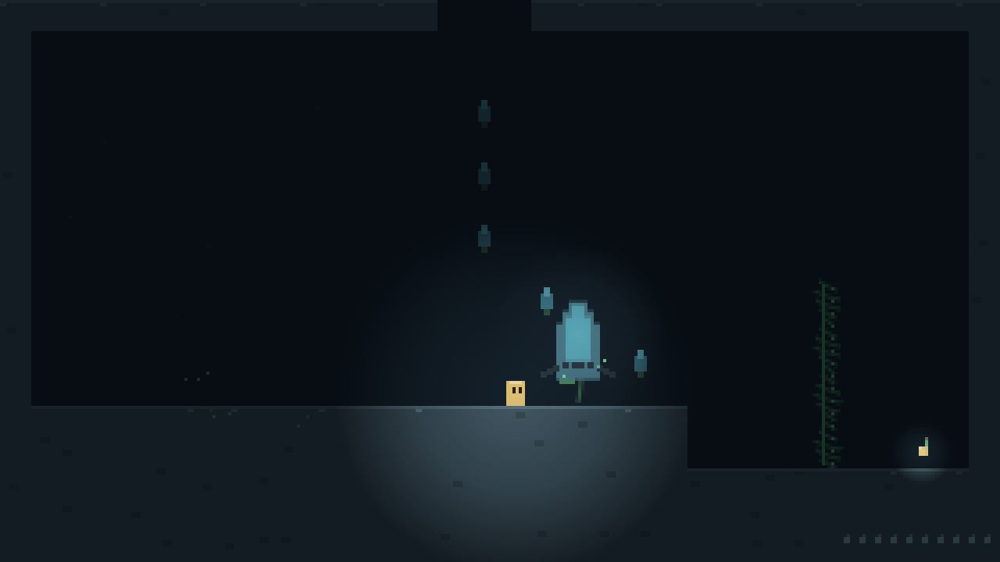

# Plant Well

致敬 [Animal Well](https://www.animalwell.com/) 的横版探索解谜游戏：坠入一口被植物重新占领的古井，靠道具的隐藏用法发现层层秘密。零依赖自研 Canvas 微引擎，同时是一个游戏开发学习项目——每个里程碑配套讲解文档（`docs/learn/`）。

设计词汇表见 [CONTEXT.md](./CONTEXT.md)，架构决策见 [docs/adr/](./docs/adr/)。



## 运行

```bash
npm install
npm run dev        # 开发，浏览器打开提示的地址
npm run build      # 类型检查 + 产线构建，输出到 dist/
npm run preview    # 本地预览构建产物
npm run test:rooms # 校验房间地图数据（洞口配对、物件引用）
```

部署是纯静态的：`npm run build` 后把 `dist/` 扔到任意静态托管即可给朋友玩。

## 操作（可在标题 KEYS 里改键）

| 动作 | 主键位 | 备用键位 |
| ---- | ------ | -------- |
| 移动 | WASD | 方向键 |
| 跳跃 | K | Z |
| 使用道具 | J | X |
| 切换道具 | L | |
| 直选道具 | 1 / 2 / 3 / 4 | |
| 确认 | Enter / J | |
| 地图 | Tab（Q/E 缩放、WASD 平移） | |
| 下穿单向平台 / 存档花旁开传送 | S | |
| 暂停 | Esc | |
| 静音 | M | |

调试模式 `?debug=1`：`[` `]` 在房间间传送，`G` 发放全部道具与源种。

8-bit 背景音乐与音效的音量在标题 **KEYS** 界面的 VOLUME 行用左右键调节（自动保存），`M` 一键静音。

## 玩法（切片内容）

- 首张地图「古井」：20 个互相咬合的房间，从井口一路到井底（含坠井捷径、蹦菇塔、悬圃、蔓豆石窟、西苔洞、井底东窟）——引擎支持任意多张地图，游戏加载哪张由数据里的 ★ 标记决定
- 4 件道具，每件都有表面用法与隐藏用法：
  - **藤鞭**：抽打开路 / **按住蓄力**伸长鞭梢、锁定钩环把角色拉过去起荡（荡的过程中左右泵摆可以越荡越远，摆荡中按跳跃能甩出去）/ 抽打够不到的机关
  - **泡泡荚**：吹出原地漂浮的泡泡、踩住它上升 / 毒雾附近吹出罩身护罩 / **用藤鞭击打漂浮的泡泡也能触发护罩**——罩身后按住方向会水平飞行，跳跃键跳出
  - **孢子笛**：让休眠花苞开成平台 / 安抚敌对的孢子游魂
  - **蔓豆**：长按使用键在脚下扎根，方向键指挥四向生长成可攀爬的藤茎
- 10 颗隐藏的**源种**，集齐后井底巨花才会为你开放——没人告诉你这件事
- **三格血**与**存档花**：尖刺/游魂掉血；在存档花旁按使用键激活（回满血+设为重生点）；血尽回到最近激活的花；已激活的花之间可以打开地图互相传送
- 地图编辑器：`npm run dev:editor` 本地全功能（编辑/保存写回/多图管理）；线上 [plant-well.pages.dev/editor](https://plant-well.pages.dev/editor) 是查看器——可浏览地图与导出 .json（保存写回仅限本地 dev）

## 结构

```
src/
  engine/   自研微引擎：循环、输入、瓦片、光照、粒子、程序音频、像素字体
  game/     游戏本体：玩家、实体、世界、标题
  data/     全部地图：maps/<id>.json（一张图一个文件）+ gameMap.json（游戏图指针）+ maps.ts（类型与派生索引）
scripts/    validate-rooms.ts（地图校验）、e2e-check.mjs（无头浏览器冒烟）
docs/
  adr/      架构决策记录
  learn/    每个里程碑的"为什么这么设计"讲解
  screenshots/
```

## 里程碑

- [x] M0 脚手架：游戏循环、输入系统（含改键）、像素缩放 → [讲解](docs/learn/m0-game-loop-and-input.md)
- [x] M1 走跳手感 + 瓦片碰撞 → [讲解](docs/learn/m1-platformer-feel.md)
- [x] M2 井的地图结构：14 房间互锁、回程路线 → [讲解](docs/learn/m2-world-and-rooms.md)
- [x] M3 道具系统 + 藤鞭三用法 → [讲解](docs/learn/m3-items-and-whip.md)
- [x] M4 泡泡荚 + 孢子笛 → [讲解](docs/learn/m4-bubble-and-flute.md)
- [x] M5 动态光照 + 程序音频 → [讲解](docs/learn/m5-light-and-audio.md)
- [x] M6 源种、巨花结局、标题/存档/改键 → [讲解](docs/learn/m6-save-title-ending.md)
